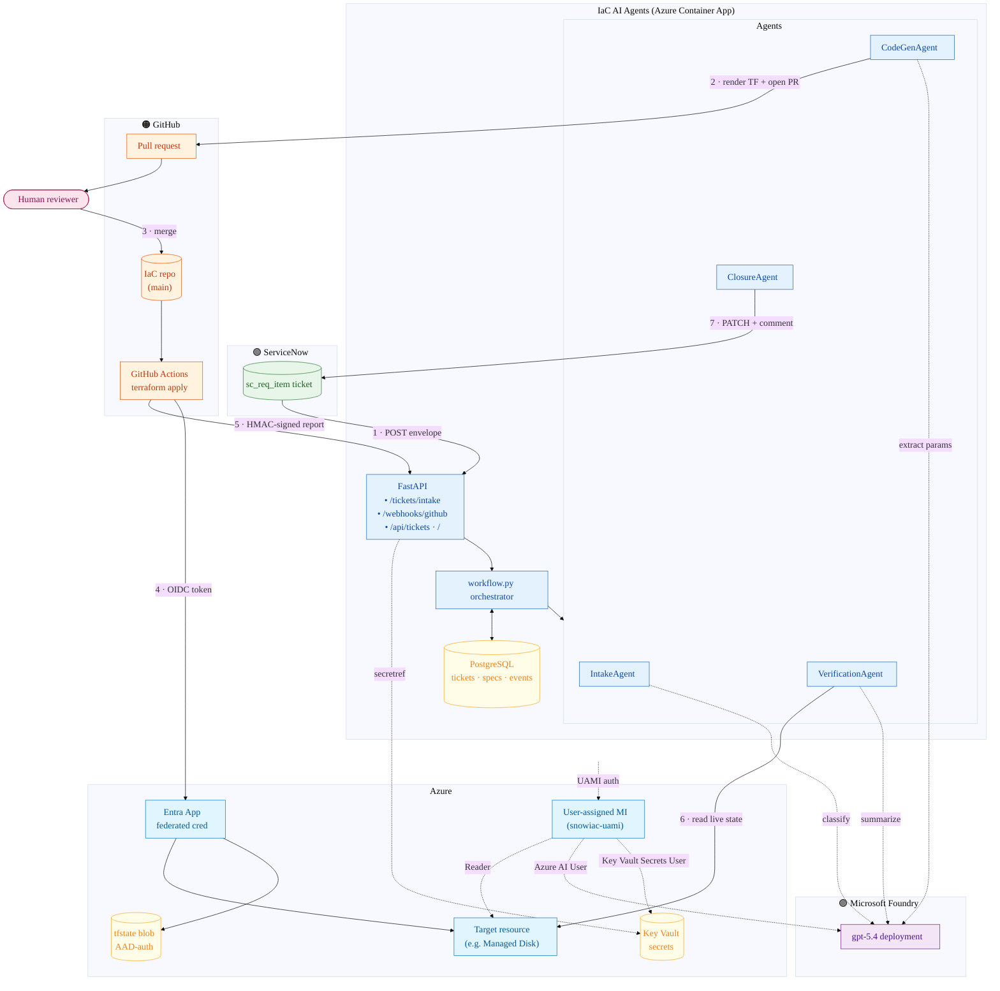
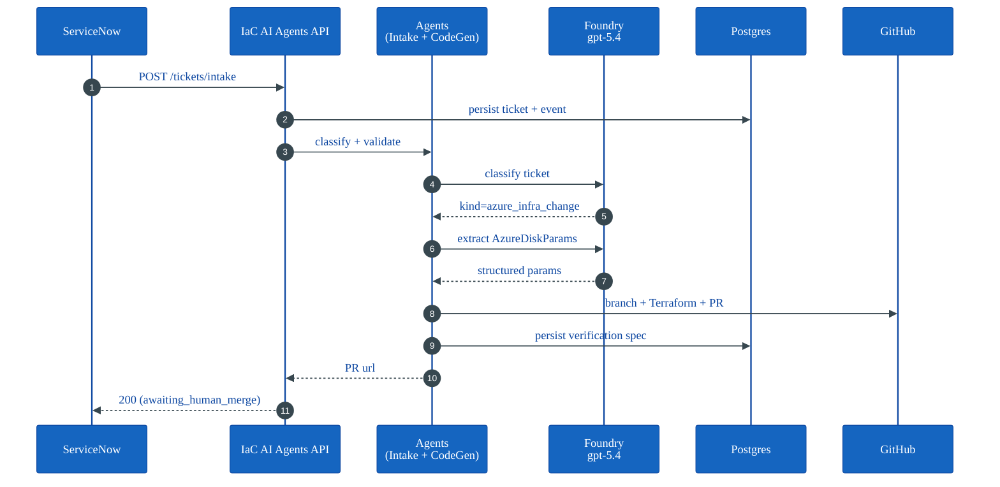
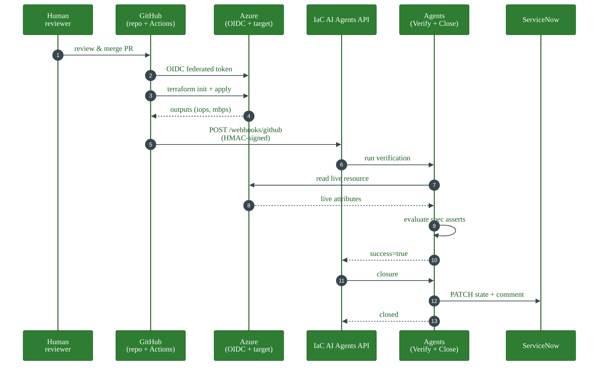

# IaC AI Agents

> A multi-agent system that takes a ServiceNow request, generates Terraform, opens a pull request, lets a human approve, deploys to Azure via GitHub Actions OIDC, verifies the live infrastructure against a spec, and auto-closes the ticket.

Built with **Microsoft Agent Framework** and **Microsoft Foundry** (`gpt-5.4`), FastAPI, Terraform, and a PostgreSQL ticket store (SQLite is supported for local dev).

---

## What it does

```
ServiceNow ticket
       │
       ▼
┌──────────────┐    ┌──────────────────┐    ┌────────────────┐
│ IntakeAgent  │───▶│ CodeGenAgent     │───▶│ Human reviewer │
│ (classify +  │    │ (LLM extracts    │    │ (GitHub PR)    │
│  validate)   │    │  params, render  │    └────────┬───────┘
└──────────────┘    │  Terraform, PR)  │             │ merge
                    └──────────────────┘             ▼
                                            ┌────────────────┐
                                            │ GitHub Actions │
                                            │ (OIDC → Azure  │
                                            │  → terraform   │
                                            │  apply)        │
                                            └────────┬───────┘
                                                     │ HMAC webhook
                                                     ▼
                                            ┌────────────────┐    ┌────────────────┐
                                            │ Verification   │───▶│ ClosureAgent   │
                                            │ Agent (compare │    │ (PATCH SNOW    │
                                            │  spec vs Azure)│    │  → Closed)     │
                                            └────────────────┘    └────────────────┘
```

Five Foundry agents collaborate:

| Agent | Job |
|---|---|
| **IntakeAgent** | Classify ticket (`azure_infra_change`), validate required fields. |
| **CodeGenAgent** | LLM-extract structured params (`AzureDiskParams`), render Jinja2 Terraform, open/update GitHub PR, persist verification spec. |
| **(human reviewer)** | Approves the PR (merge is gated by a required policy-as-code check). |
| **VerificationAgent** | **Fails closed**: requires the deploy report `status=applied` *and* a persisted spec, then reads the live Azure resource and evaluates the assertions. Missing spec or `status≠applied` → escalate, never auto-close. |
| **ClosureAgent** | Posts an evidence comment to ServiceNow and transitions the ticket to *Closed Complete*. **Resilient**: if ServiceNow is unreachable it falls back to email and marks the ticket *Closed Complete (SNOW sync pending)* rather than failing the flow. |

---

## Demo flow

1. Run the server.
2. Open the dashboard at <http://127.0.0.1:8765/>.
3. POST a sample ticket — watch `INTAKE → INTAKE VALIDATED → AWAITING HUMAN MERGE` appear.
4. Open the GitHub PR, review, **merge**.
5. GitHub Actions authenticates to Azure via OIDC, runs `terraform apply`, and POSTs an HMAC-signed report back to the server.
6. Dashboard cascades to `DEPLOY APPLIED → VERIFIED → COMPLETE`.
7. ServiceNow ticket is automatically closed with verification evidence.

### Run the demo end-to-end

> **Prerequisite checklist** — confirm each line before starting:
>
> - [ ] `terraform apply` in [`infra/`](infra/) succeeded (Container App, ACR, Key Vault, UAMI, Foundry role assignment all exist)
> - [ ] Container App revision is running with the current image `snowiacacrehlgt.azurecr.io/snowiac:v4` and `FOUNDRY_MODEL_DEPLOYMENT_NAME = gpt-5.4`
> - [ ] Key Vault holds **all four** secrets: `database-url`, `webhook-hmac-secret`, `snow-password`, `github-token`
> - [ ] Postgres Flexible Server is reachable and the `snowiac` database exists
> - [ ] In the IaC repo (e.g. `lindazhang2000/iac-ai-agents`) the GHA secrets are set: `SNOWIAC_WEBHOOK_URL`, `SNOWIAC_WEBHOOK_SECRET`, `AZURE_CLIENT_ID`, `AZURE_TENANT_ID`, `AZURE_SUBSCRIPTION_ID`
> - [ ] The federated SP has **Contributor** on the target RG (where the disk lives) and **Storage Blob Data Contributor** on the tfstate account
> - [ ] Local `.env` has `SNOW_INSTANCE_URL`, `SNOW_USER`, `SNOW_PASSWORD`, `GITHUB_TOKEN`, `GITHUB_REPO`
> - [ ] `az login` complete and `gh auth status` shows authenticated
> - [ ] The target Azure resource exists (e.g. managed disk `sql1-data` in RG `MultiAgentSnow`) — the agent **modifies** it, it doesn't create it

#### Step 1 — Submit a real ServiceNow request

```powershell
./tools/submit_and_ingest.ps1 -Item Azure
```

This creates a live RITM (e.g. `RITM0010009`) in your ServiceNow dev instance, pulls it back, reshapes it into the intake payload, and POSTs it to the deployed Container App's `/tickets/intake`. Expected output ends with the RITM number and `200 OK`.

#### Step 2 — Watch the dashboard

```powershell
$fqdn = az containerapp show -n snowiac-app -g snowiac-app-rg `
        --query properties.configuration.ingress.fqdn -o tsv
Start-Process "https://$fqdn/"
```

Expected timeline within ~30 seconds:

| Stage | Meaning |
|---|---|
| `INTAKE` | Ticket received and persisted |
| `INTAKE VALIDATED` | IntakeAgent classified `kind=azure_infra_change` and all required fields present |
| `CODEGEN STARTED` | LLM extracting `AzureDiskParams` |
| `PR OPENED` | Branch + Terraform pushed; PR url visible in dashboard |
| `AWAITING HUMAN MERGE` | Pipeline paused — your turn |

If you don't reach `AWAITING HUMAN MERGE` within a minute, tail the logs:

```powershell
az containerapp logs show -n snowiac-app -g snowiac-app-rg --tail 100 --type console
```

#### Step 3 — Review and merge the PR

```powershell
# Click the link in the dashboard or:
gh pr list --repo $env:GITHUB_REPO
gh pr view <pr-number> --web
```

Inspect the diff: a single new file under `azure/ritmXXXXXXX/` containing a `resource "azurerm_managed_disk"` with an `import {}` block and the new `disk_iops_read_write` / `disk_mbps_read_write` values. The verification spec (`spec.json` in the PR body) shows what the agent will assert post-deploy.

```powershell
gh pr merge <pr-number> --squash --delete-branch
```

#### Step 4 — Watch GitHub Actions apply

```powershell
gh run watch --repo $env:GITHUB_REPO
```

The `terraform-apply` workflow will: OIDC-auth to Azure → `terraform init` (AAD backend) → `terraform plan` → `terraform apply` → POST an HMAC-signed report to `$SNOWIAC_WEBHOOK_URL`. Total time is typically 60–90 seconds.

Simultaneously, tail the Container App logs to see the inbound webhook and verification:

```powershell
az containerapp logs show -n snowiac-app -g snowiac-app-rg --tail 50 --follow
```

#### Step 5 — Dashboard cascades to COMPLETE

Refresh the dashboard. Expected final stages:

| Stage | Meaning |
|---|---|
| `DEPLOY APPLIED` | HMAC webhook accepted; `terraform apply` succeeded |
| `VERIFIED` | VerificationAgent read the live disk from Azure and all spec asserts passed |
| `COMPLETE` | ClosureAgent PATCHed ServiceNow → state = Closed Complete |

#### Step 6 — Confirm the side effects

```powershell
# A. Live Azure resource matches the request
az disk show -g MultiAgentSnow -n sql1-data --query "{iops:diskIopsReadWrite, mbps:diskMBpsReadWrite}" -o json

# B. ServiceNow ticket really closed
./tools/ingest_from_snow.ps1 -Ritm <RITMxxxxxxx>
# State should be "Closed Complete" with the agent's evidence comment in work_notes.

# C. Event timeline (audit trail)
curl.exe -s "https://$fqdn/api/tickets/<RITMxxxxxxx>" | ConvertFrom-Json | Select-Object -ExpandProperty events
```

#### Troubleshooting

| Symptom | Likely cause | Fix |
|---|---|---|
| Stuck at `INTAKE` | Foundry 401 / model name mismatch | Check container env `FOUNDRY_MODEL_DEPLOYMENT_NAME=gpt-5.4` and UAMI has `Azure AI User` on the Foundry account |
| Stuck at `CODEGEN STARTED` | `GITHUB_TOKEN` missing/expired in Key Vault | `az keyvault secret set --vault-name <kv> --name github-token --value <pat>` then restart revision |
| Stuck at `AWAITING HUMAN MERGE` after merge | GHA `terraform-apply` didn't trigger | Confirm the merged file path matches `azure/**` and the workflow ran |
| `DEPLOY APPLIED` then no `VERIFIED` | UAMI lacks `Reader` on target RG | Grant it (already encoded in `infra/identity.tf` for the verifier RG) |
| `terraform init` fails `403 AuthorizationFailure` (ListBlobs) | tfstate storage account `publicNetworkAccess = Disabled` blocks GitHub-hosted runners | Use a self-hosted VNet runner, add the runner egress IP to the storage firewall, or briefly toggle public access for the apply |
| HMAC 401 in container logs | Secret mismatch between GH repo and Key Vault | `terraform output -raw webhook_hmac_secret` and update the IaC repo secret |

#### Local-only variant (no Azure, no SNOW round-trip)

For offline demos or development: set `SNOWIAC_USE_MOCKS=true` in `.env`, start the server with `uvicorn snowiac.server:app --port 8765`, and POST a hand-crafted ticket to `http://127.0.0.1:8765/tickets/intake` — see [`Sample_ER_Azure_Cloud_Admin.json`](Sample_ER_Azure_Cloud_Admin.json) for a payload template.

---

## Architecture

### System overview



### Request lifecycle (sequence)

The flow is split into two phases — **intake → PR** (before the human merges) and **deploy → close** (after the merge) — so each diagram has fewer participants and reads top-to-bottom.

#### Phase 1 — Intake → PR opened



#### Phase 2 — Merge → Deploy → Verify → Close



### Component responsibilities

| Layer | Module | Responsibility |
|---|---|---|
| **Edge** | `server.py` | HTTP surface — ticket intake, GitHub webhook (HMAC-verified), dashboard, JSON API. |
| **Orchestration** | `workflow.py` | Two flows (`run_intake_flow`, `run_post_deploy_flow`) wired to the `TicketStore` from `store.py`. Durable in-process state machine (`workflow_state`) with webhook **idempotency** (`processed_runs`); a failed post-deploy run releases its `run_id` so a GitHub retry re-drives. |
| **Agents** | `agents/intake.py` | Foundry LLM call to classify the ticket, validate required payload fields. |
|  | `agents/code_generation.py` | LLM-extract structured `AzureDiskParams`, render Jinja2 Terraform (`fmt`-clean, tagged), open/update PR via PyGithub, persist spec. |
|  | `agents/verification.py` | Fail-closed, spec-driven assertion runner that reads the live Azure resource; escalates (best-effort SNOW, guarded) on mismatch. |
|  | `agents/closure.py` | Compose evidence comment, PATCH ServiceNow (deterministic). SNOW outage → email fallback + *Closed Complete (SNOW sync pending)*. |
| **Services** | `services/azure_verifier.py` | `azure-mgmt-compute` wrapper + `verify_spec` op evaluator (`>=`, `<=`, `==`, `!=`, `>`, `<`). |
|  | `services/parameter_extractor.py` | LLM-structured extraction with regex fallback. |
|  | `services/terraform_generator.py` | StrictUndefined Jinja2 renderer for templates and tfvars. |
|  | `services/github_repo.py` | PyGithub branch/file/PR upserts (idempotent reuse). |
|  | `services/servicenow.py` | ServiceNow REST client (lookup, PATCH, comment) + in-memory mock. |
|  | `services/notifier.py` | SMTP email sink — closure notification for non-SNOW channels and the ServiceNow-outage fallback. |
| **Persistence** | PostgreSQL (Azure Database for PostgreSQL Flexible Server) | `tickets`, `specs`, `events`, `workflow_state`, `processed_runs` tables. Connection string sourced from Key Vault. Falls back to local SQLite (`snowiac.db`) when `DATABASE_URL` is unset. |
| **CI/CD** | `.github/workflows/terraform-plan.yml` | Hermetic policy-as-code PR gate (conftest/OPA + Checkov); enforced as a required status check. |
|  | `.github/workflows/terraform-apply.yml` | OIDC login, AAD-auth backend, plan/apply, HMAC callback. |

### Trust & security model

- **No long-lived Azure credentials.** GitHub Actions exchanges an OIDC ID-token for a short-lived Azure token via a federated credential on an Entra app.
- **No storage account keys.** Terraform azurerm backend uses `use_azuread_auth=true`; the federated SP has `Storage Blob Data Contributor` on the tfstate account.
- **Human-in-the-loop gate.** Nothing is applied to Azure until a reviewer merges the PR — Terraform is *generated* by an LLM, but never *executed* by it.
- **Webhook integrity.** GitHub Actions HMAC-SHA256-signs every callback; the server rejects unsigned/mismatched payloads.
- **Spec-driven, fail-closed verification.** Approval doesn't equal correctness. The post-deploy verifier reads the live resource and evaluates the spec generated *before* deployment, catching drift between intent and reality. For cloud changes it **fails closed**: a missing spec or a non-`applied` deploy status escalates instead of auto-closing.
- **Policy-as-code gate.** A required, hermetic `policy-gate` check (conftest/OPA + Checkov) blocks any PR whose Terraform is missing governance tags, exceeds IOPS/throughput caps, or opens management ports to the internet.
- **Durable & idempotent.** Workflow state is persisted (`workflow_state`) and webhooks are de-duplicated by `run_id` (`processed_runs`); a failed post-deploy run releases its id so a GitHub retry safely re-drives.
- **Resilient closure.** A ServiceNow outage never crashes the flow \u2014 closure falls back to email and records *Closed Complete (SNOW sync pending)* for a later manual sync.
- **Auditability.** Every state transition is appended to the `events` table and surfaced in the dashboard timeline.

### Key design decisions

| Decision | Why |
|---|---|
| Use **Microsoft Agent Framework** with separate agents per stage | Each agent has a tight, swappable contract (Pydantic in/out); easier to test, retry, and reason about than one mega-prompt. |
| **LLM extracts params, deterministic code renders TF** | LLMs are unreliable at producing valid Terraform syntax; Jinja2 with StrictUndefined fails fast on missing fields. |
| **Terraform `import {}` block** instead of `terraform import` CLI | Declarative, reviewable in the PR diff, no out-of-band state mutation. |
| **`lifecycle.ignore_changes = [zone, ...]`** | Prevents azurerm v4 from planning destroy/recreate when imported state has zonal placement that's not in the config. |
| **OIDC over service-principal secrets** | No secret rotation; tightly scoped to a single repo + branch via federated credential subject. |
| **AAD auth for tfstate backend** | Storage account can have key auth disabled entirely. |
| **SQLite (local) / PostgreSQL (cloud)** | One factory (`make_store`) picks the backend from `DATABASE_URL`. SQLite is zero-ops for local dev; Postgres is required for any production deployment behind Azure Container Apps (filesystem isn't durable across revisions). |
| **Spec persisted at PR time, not at apply time** | Locks the acceptance criteria to what the human approved, not whatever the runner happens to compute. |
| **Public dev tunnel for webhooks** | VS Code Dev Tunnels are Microsoft-signed (passes Application Control); ngrok/cloudflared are typically blocked. |

---

## Project layout

```
src/snowiac/
  agents/
    intake.py            # ticket classifier
    code_generation.py   # LLM param extractor + Terraform renderer + PR opener
    verification.py      # spec-driven Azure verifier
    closure.py           # SNOW patcher
  services/
    azure_verifier.py    # azure-mgmt-compute calls + assertion engine
    github_repo.py       # PyGithub wrapper
    notifier.py          # SMTP email closure sink (non-SNOW channel + fallback)
    parameter_extractor.py
    servicenow.py        # ServiceNow REST client + mock
    terraform_generator.py
  static/
    dashboard.html       # live UI
  agent_entry.py         # Foundry hosted-agent entry point (intake-only)
  config.py              # pydantic-settings (.env)
  llm.py                 # shared FoundryChatClient factory
  models.py              # Pydantic models
  server.py              # FastAPI: /tickets/intake, /webhooks/github, /api/tickets, /
  store.py               # Postgres/SQLite TicketStore
  workflow.py            # flow orchestration (intake + post-deploy)
terraform_templates/
  azure_disk_change.tf.j2
  *_backend.tf.j2
policy/
  snowiac.rego           # OPA/conftest policy enforced on every PR
.github/workflows/
  terraform-plan.yml     # hermetic policy-as-code PR gate (required check)
  terraform-apply.yml    # OIDC auth + AAD-auth backend + HMAC callback
```

---

## Setup

### Prerequisites

- Python 3.12, Terraform 1.5+, Azure CLI, GitHub CLI (`gh`)
- A Microsoft Foundry project with a `gpt-5.4` (or compatible) deployment
- An Azure subscription, a resource group, and a storage account for tfstate (key auth can be disabled — backend uses AAD)
- A GitHub repo for the generated Terraform
- A ServiceNow instance (developer instance works fine)

### Install

```powershell
python -m venv .venv
.\.venv\Scripts\pip install -r requirements.txt
Copy-Item .env.template .env
# fill in .env
```

### Run the server

```powershell
$env:PYTHONPATH = "src"
$env:SNOWIAC_USE_MOCKS = "false"
.\.venv\Scripts\python.exe -m uvicorn snowiac.server:app --port 8765
```

Open <http://127.0.0.1:8765/>.

### Submit a ticket

```powershell
$body = Get-Content Sample_ER_Azure_Cloud_Admin.json -Raw
curl.exe -X POST http://127.0.0.1:8765/tickets/intake `
  -H "content-type: application/json" --data-binary "$body"
```

---

## GitHub Actions CI (OIDC)

`.github/workflows/terraform-apply.yml` runs on pushes to `main` that touch `azure/**`.

It authenticates **without secrets** using a federated credential on an Entra app, then uses **AAD auth for the azurerm backend** (no storage keys).

Required repo configuration:

| Type | Name | Purpose |
|---|---|---|
| Variable | `TFSTATE_RESOURCE_GROUP` | Holds the tfstate storage account |
| Variable | `TFSTATE_STORAGE_ACCOUNT` | Storage account name |
| Variable | `TFSTATE_CONTAINER`       | Container name (e.g. `tfstate`) |
| Secret   | `AZURE_CLIENT_ID`         | Entra app (federated) client id |
| Secret   | `AZURE_TENANT_ID`         | Tenant id |
| Secret   | `AZURE_SUBSCRIPTION_ID`   | Subscription id |
| Secret   | `SNOWIAC_WEBHOOK_URL`     | Public URL of `/webhooks/github` |
| Secret   | `SNOWIAC_WEBHOOK_SECRET`  | HMAC-SHA256 secret matching `WEBHOOK_HMAC_SECRET` |

Required RBAC on the federated SP:

- **Contributor** on the target resource group
- **Storage Blob Data Contributor** on the tfstate storage account

> **Note — network-locked tfstate.** If the tfstate storage account has `publicNetworkAccess = Disabled`, GitHub-hosted runners cannot reach the backend and `terraform init` fails with `403 AuthorizationFailure`. Either run the apply on a **self-hosted runner inside the VNet**, add the runner's egress IP to the storage firewall, or briefly toggle public access for the apply window.

### Policy-as-code PR gate (required check)

Every pull request runs [`.github/workflows/terraform-plan.yml`](.github/workflows/terraform-plan.yml) (job `policy-gate`). It is **hermetic** — no Azure login, no remote backend — so it passes even when the tfstate account is network-locked:

1. Detect the changed `azure/<ticket>` directory (short-circuits to a pass when a PR touches no `azure/**` files, so the required check always reports).
2. `terraform fmt -check` + `terraform init -backend=false` + `terraform validate`.
3. **Conftest** ([`policy/snowiac.rego`](policy/snowiac.rego), OPA) — **blocking**. Denies any `azurerm_*` resource missing the `snow_ticket`/`managed_by` tags, caps `disk_iops_read_write` / `disk_mbps_read_write`, and blocks wide-open inbound NSG rules on ports 22/3389.
4. **Checkov** — report-only (soft-fail) with a PR comment.

`policy-gate` is enforced as a **required status check** via a repository ruleset, so no PR can merge until it passes. The CodeGenAgent emits Terraform that is already `fmt`-clean and carries the required tags.

---

## Public webhook for local demo

Use VS Code Dev Tunnels (Microsoft-signed, works under most endpoint-protection policies):

```powershell
# In VS Code: Command Palette → "Forward a Port" → 8765 → Public
# Then set SNOWIAC_WEBHOOK_URL to the https://<id>-8765.<region>.devtunnels.ms/webhooks/github
```

---

## Verification spec

Each PR persists a small JSON spec into the ticket store that the VerificationAgent uses to assert the post-deploy state:

```json
{
  "resource_type": "azurerm_managed_disk",
  "resource_group_name": "MultiAgentSnow",
  "resource_name": "sql1-data",
  "asserts": {
    "disk_iops_read_write": { "op": ">=", "value": 5000 },
    "disk_mbps_read_write": { "op": ">=", "value": 350 }
  }
}
```

Supported ops: `>=`, `<=`, `==`, `!=`, `>`, `<`.

---

## API

| Method | Path | Purpose |
|---|---|---|
| `GET`  | `/`                       | Live dashboard (HTML) |
| `GET`  | `/health`                 | Health check |
| `GET`  | `/api/tickets`            | List all tracked tickets + last stage |
| `GET`  | `/api/tickets/{id}`       | Ticket + spec + full event timeline |
| `POST` | `/tickets/intake`         | Submit a ServiceNow ticket (envelope or bare) |
| `POST` | `/webhooks/github`        | HMAC-signed deployment callback from GH Actions |

---

## Configuration reference

See `.env.template`. Key settings:

| Var | Default | Notes |
|---|---|---|
| `FOUNDRY_PROJECT_ENDPOINT` | — | Microsoft Foundry project URL |
| `FOUNDRY_MODEL_DEPLOYMENT_NAME` | `gpt-4.1-mini` | Foundry deployment name (`.env.template` ships `gpt-5.4`) |
| `SNOW_INSTANCE_URL` / `SNOW_USER` / `SNOW_PASSWORD` | — | ServiceNow REST creds |
| `SNOWIAC_USE_MOCKS` | `true` | Code default mocks external systems; `.env.template` sets `false`. Set `true` to bypass external systems |
| `GITHUB_TOKEN` / `GITHUB_REPO` / `GITHUB_BASE_BRANCH` | — | PyGithub config |
| `AZURE_SUBSCRIPTION_ID` | — | For VerificationAgent |
| `WEBHOOK_HMAC_SECRET` | `change-me` | Must match `SNOWIAC_WEBHOOK_SECRET` in GH |
| `SNOWIAC_DB_PATH` | `snowiac.db` | SQLite file for tickets/specs/events |
| `DATABASE_URL` | _(empty)_ | If set to `postgresql://…`, Postgres backend is used instead of SQLite |

---

## Deploy to Azure (Container Apps)

The repo includes a complete Terraform stack under [`infra/`](infra/) that provisions:

- **Resource group** `snowiac-app-rg` in `eastus`
- **Azure Container Registry** (Basic) for the app image
- **Log Analytics workspace** for Container Apps logs
- **Container Apps environment** + **Container App** (single replica, 0.5 vCPU / 1 GiB)
- **Key Vault** (RBAC mode) — holds the Postgres URL, HMAC secret, ServiceNow password, GitHub token
- **User-assigned managed identity** with `Reader` on the verifier RG, `Key Vault Secrets User` on the vault, and **`Azure AI User`** on the Foundry account (which may live in a different RG)
- **Entra app + federated credential** for the GitHub Actions deploy workflow (no SP secrets)

Provisioned **out of band** (not yet in this Terraform stack, but the connection string is wired into Key Vault):

- **Postgres Flexible Server** — ticket store. Provision with `az postgres flexible-server create` and seed `database-url` in the vault.
- **Microsoft Foundry account + model deployment** — reference it via `foundry_account_id` and `foundry_model_deployment_name` in `terraform.tfvars` so the role assignment scopes correctly.

### One-time provisioning

```powershell
# 1. Authenticate
az login
az account set --subscription <your-sub>

# 2. Configure
cd infra
Copy-Item terraform.tfvars.example terraform.tfvars
# edit terraform.tfvars

# 3. Provision (creates everything; Container App boots on a placeholder image)
terraform init
terraform apply

# 4. Capture outputs
terraform output -raw container_app_webhook_url     # set as SNOWIAC_WEBHOOK_URL secret in your IaC repo
terraform output -raw webhook_hmac_secret           # set as SNOWIAC_WEBHOOK_SECRET secret in your IaC repo
terraform output -raw uami_client_id                # exposed to the container as AZURE_CLIENT_ID

# 5. Seed operator-supplied secrets into Key Vault
.\seed-secrets.ps1                                  # reads ../.env for SNOW_PASSWORD + GITHUB_TOKEN
# Postgres connection string (provision the server separately, then):
az keyvault secret set --vault-name <kv> --name database-url --value "postgresql://..."
```

### Build & deploy the app image

Set these GitHub Actions secrets in **this** repo:

| Secret | Value |
|---|---|
| `AZURE_DEPLOY_CLIENT_ID`  | clientId of the `snowiac-gha-tf` Entra app (created out-of-band; see [`tools/setup_gha_oidc.ps1`](tools/setup_gha_oidc.ps1)) |
| `AZURE_TENANT_ID`         | your tenant id |
| `AZURE_SUBSCRIPTION_ID`   | your subscription id |

Then push to `main` — [`.github/workflows/deploy-snowiac.yml`](.github/workflows/deploy-snowiac.yml) will:
1. OIDC-login to Azure
2. `az acr build` the Dockerfile into ACR
3. `az containerapp update` to roll the new revision

Or trigger manually from the Actions tab.

### Wire up the IaC repo

In the repo IaC AI Agents opens PRs in (e.g. `lindazhang2000/iac-ai-agents`), set:

| Secret | Value |
|---|---|
| `SNOWIAC_WEBHOOK_URL`     | from `terraform output container_app_webhook_url` |
| `SNOWIAC_WEBHOOK_SECRET`  | from `terraform output webhook_hmac_secret` |

The existing [`.github/workflows/terraform-apply.yml`](.github/workflows/terraform-apply.yml) already POSTs HMAC-signed reports to `$SNOWIAC_WEBHOOK_URL` after each apply — no other changes needed.

### Verify

```powershell
$fqdn = az containerapp show -n snowiac-app -g snowiac-app-rg --query properties.configuration.ingress.fqdn -o tsv
curl.exe "https://$fqdn/api/tickets"     # → [] (or recent tickets)
Start-Process "https://$fqdn/"           # opens the dashboard
```

### Cost estimate (eastus, list price)

| Resource | ~Monthly |
|---|---|
| Container App (1 replica, 0.5 vCPU, 1 GiB, always-on) | ~$15 |
| Postgres B1ms 32 GB | ~$13 |
| ACR Basic | ~$5 |
| Log Analytics (small volumes) | ~$2 |
| Key Vault | <$1 |
| **Total** | **~$35/mo** |

Scale to zero (`min_replicas = 0`) if you don't need the dashboard always-on — drops Container App cost to near-zero.

---

## Tech stack

- **Microsoft Agent Framework** 1.0.0rc6 (`Agent` + `FoundryChatClient`, `AzureCliCredential`)
- **Microsoft Foundry** (gpt-5.4)
- **FastAPI** + Uvicorn
- **Pydantic v2** + pydantic-settings
- **Jinja2** (StrictUndefined) for Terraform templates
- **Terraform 1.5+** with `import {}` blocks, `azurerm` ~> 4.0, AAD-auth backend
- **azure-mgmt-compute** for live verification
- **PyGithub** for PR automation
- **PostgreSQL** (Azure Database for PostgreSQL Flexible Server) for ticket/spec/event persistence, with **SQLite** (stdlib) as the local-dev fallback
- **GitHub Actions** with OIDC federated credentials
